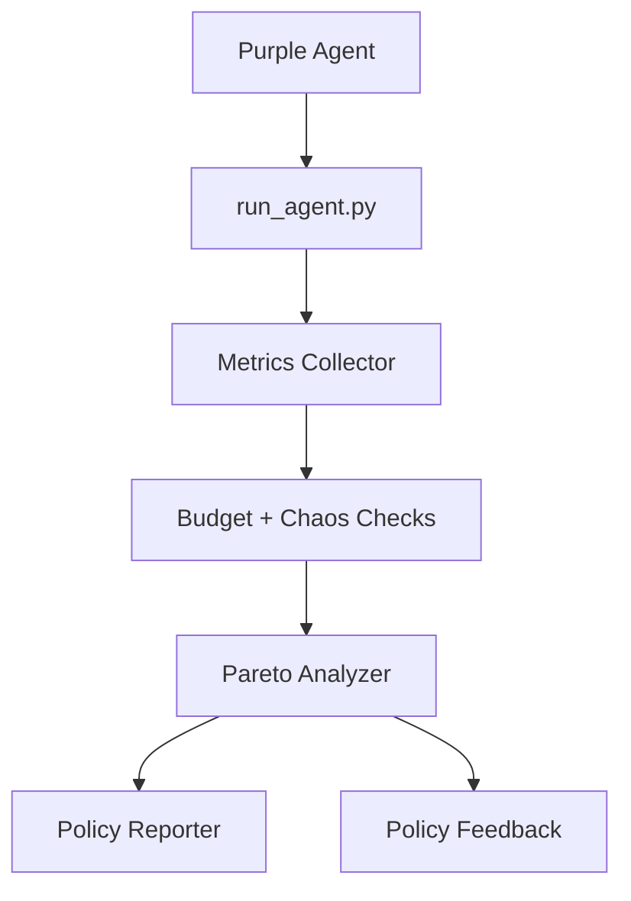

---

# 🌱 Green_Agent

Green_Agent is a **resource-aware evaluation agent** for assessing autonomous agents under performance, efficiency, and sustainability constraints.
It observes agent execution, collects multi-dimensional metrics, and evaluates outcomes using **Pareto-based analysis** rather than single-score aggregation.

---

## 🧠 System Architecture

### High-Level Architecture (ASCII)

```
┌──────────────────────────────────────────────┐
│              Container Runtime               │
│                                              │
│  ┌─────────────┐        ┌─────────────────┐ │
│  │ Purple Agent│──────▶ │  Execution Loop │ │
│  │ (Assessee)  │        │  (run_agent.py) │ │
│  └─────────────┘        └────────┬────────┘ │
│                                   │          │
│                                   ▼          │
│        ┌──────────── Metrics Collection ────────────┐
│        │ latency | energy | carbon | memory | tools │
│        └───────────────┬────────────────────────────┘
│                        ▼
│               ┌─────────────────┐
│               │ Budget / Chaos  │
│               │ Enforcement     │
│               └────────┬────────┘
│                        ▼
│               ┌─────────────────┐
│               │ Pareto Analyzer │
│               └────────┬────────┘
│                        ▼
│        ┌──────────────────────────────────┐
│        │ Reports / Leaderboards / Feedback│
│        └──────────────────────────────────┘
└──────────────────────────────────────────────┘
```

---

### Logical Data Flow (Mermaid)



---

## 🔁 Execution Lifecycle

1. Runtime initializes execution context
2. Purple agent begins execution
3. Metrics are streamed continuously
4. Budgets are checked on every step
5. Chaos module may inject failures
6. Execution terminates (success or enforced)
7. Metrics are normalized and evaluated
8. Pareto frontier and reports are generated

---

## 🗂 Core Modules (with Docstrings)

Below are **module-level docstrings** you can paste directly into each file.

---

### `run_agent.py`

```python
"""
run_agent.py

Main execution entrypoint for Green_Agent.

Responsibilities:
- Load execution policies and budgets
- Initialize metric collectors
- Execute purple (assessee) agents
- Enforce resource constraints and termination rules
- Emit structured evaluation results

Design principles:
- Deterministic execution
- Never crash (fail-safe guards)
- Framework-agnostic
- JSON-only outputs
"""
```

---

### `pareto_analyzer.py`

```python
"""
pareto_analyzer.py

Implements multi-objective evaluation using Pareto dominance.

Responsibilities:
- Define dominance across heterogeneous metrics
- Compute Pareto frontiers
- Compare agents without collapsing metrics into a single score

Metrics supported:
- Accuracy / task proxy
- Latency
- Energy
- Carbon
- Memory
- Tool calls
- Conversation depth
- Framework overhead
"""
```

---

### `chaos.py`

```python
"""
chaos.py

Provides deterministic chaos and failure injection.

Responsibilities:
- Simulate budget exhaustion
- Force early termination
- Validate evaluator behavior under stress
- Test robustness against runaway agents

Chaos scenarios are controlled and reproducible.
"""
```

---

### `policy_reporter.py`

```python
"""
policy_reporter.py

Aggregates raw execution metrics into structured artifacts.

Responsibilities:
- Normalize metrics
- Generate leaderboard-compatible outputs
- Persist Pareto frontier results
- Maintain schema stability for downstream consumers
"""
```

---

### `policy_feedback.py`

```python
"""
policy_feedback.py

Provides interpretability and diagnostics for evaluations.

Responsibilities:
- Explain why an agent passed or failed
- Highlight budget violations
- Summarize trade-offs between metrics
- Generate human-readable feedback from raw scores
"""
```

---

### `green_policy.yml`

```yaml
# green_policy.yml
# Declarative execution policy for Green_Agent
#
# Defines:
# - Resource budgets (energy, latency, carbon)
# - Execution profiles
# - Termination conditions
#
# Policies are runtime-agnostic and framework-independent.
```

---

## 📊 Multi-Query AgentBeats Submission

AgentBeats requires **queries to be an array**. Each query launches the same image with different budgets.

```json
{
  "image": "ghcr.io/nurcholishadam/green-agent:latest",
  "queries": [
    {
      "id": "low-energy",
      "command": ["python", "run_agent.py"],
      "environment": {
        "QUERY_MODE": "low_energy",
        "MAX_ENERGY_WH": "0.03"
      }
    },
    {
      "id": "balanced",
      "command": ["python", "run_agent.py"],
      "environment": {
        "QUERY_MODE": "balanced",
        "MAX_ENERGY_WH": "0.06"
      }
    },
    {
      "id": "high-accuracy",
      "command": ["python", "run_agent.py"],
      "environment": {
        "QUERY_MODE": "high_accuracy"
      }
    }
  ]
}
```

Each query → one datapoint → Pareto aggregation offline.

---

## 🐳 Docker Integration

* Python 3.11 slim base
* cgroup access enabled for metrics
* No background servers
* Deterministic, CI-safe execution

Docker image is published to **GHCR** and referenced by AgentBeats.

---


## 📊 Metrics Model

Metrics are intentionally **not collapsed**.

### Categories

* **Task Outcome**

  * Accuracy or success proxy
* **Efficiency**

  * Latency
  * Energy
  * Carbon
  * Memory
* **Behavior**

  * Tool calls
  * Conversation depth
* **Overhead**

  * Framework-induced latency/energy

Pareto dominance is computed across these dimensions.

---

## ⚖️ Evaluation Philosophy

* No single “winner”
* Multiple agents may be optimal
* Trade-offs are explicit and inspectable
* Budget violations are first-class outcomes

This prevents metric gaming and preserves interpretability.

---

## 🧱 Repository Layout

```text
.
├── run_agent.py
├── pareto_analyzer.py
├── chaos.py
├── policy_reporter.py
├── policy_feedback.py
├── green_policy.yml
├── requirements.txt
├── Dockerfile
└── README.md
```

---

## 🧑‍💻 Developer Onboarding Guide

### 1️⃣ Understand the Core Loop

Start with:

* `run_agent.py` → execution + metrics
* `pareto_analyzer.py` → evaluation logic

Do **not** modify purple agent logic unless adding adapters.

---

### 2️⃣ Adding a New Metric

1. Collect metric in `run_agent.py`
2. Normalize it in `policy_reporter.py`
3. Add it to dominance logic in `pareto_analyzer.py`
4. Document it in `policy_feedback.py`

---

### 3️⃣ Adding a New Execution Policy

1. Add profile to `green_policy.yml`
2. Ensure budgets are enforced in `run_agent.py`
3. Validate via chaos tests

---

### 4️⃣ Adding Framework Support

* Wrap framework execution in `run_agent.py`
* Measure overhead explicitly
* Never hide framework costs

---

### 5️⃣ Testing Changes

* Use deterministic purple agents
* Validate monotonic metrics
* Verify Pareto ordering manually

---

## 🧩 Extensibility Notes

This architecture intentionally supports:

* New metrics without refactoring
* New dominance rules
* Real hardware counters
* Live dashboards
* Enterprise policy enforcement

All without breaking compatibility.

---

## License
This project is licensed under the MIT License - see the LICENSE file for details.

## 👤 Author

**Nurcholish Adam**
**nurcholishadam@gmail.com**
**github.com/nurcholishadam**

---

🙏 Acknowledgments

AgentBeats Team - Platform and A2A protocol
THUDM - AgentBench framework
Qiskit Team - Quantum computing toolkit
RDI Foundation - Green agent template
Quantum ML Community - QGNN research and implementations

---
